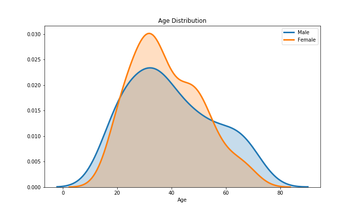
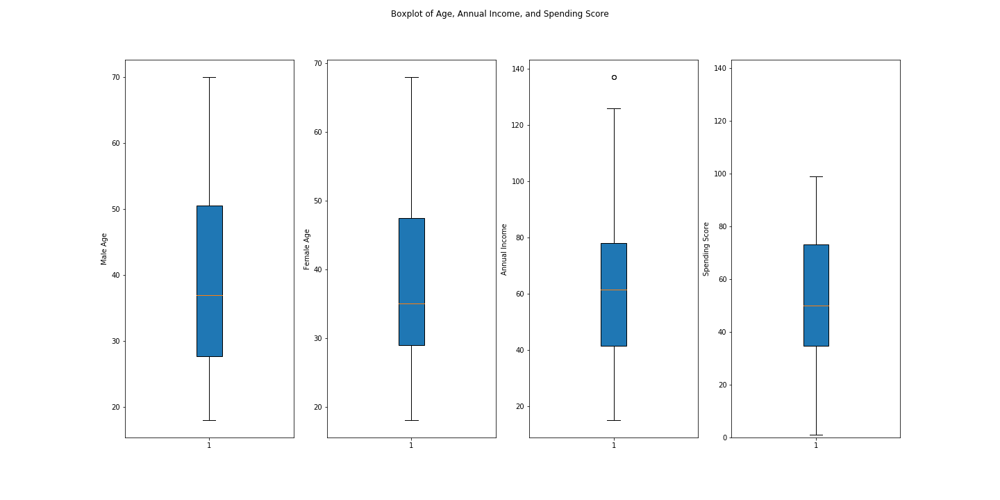
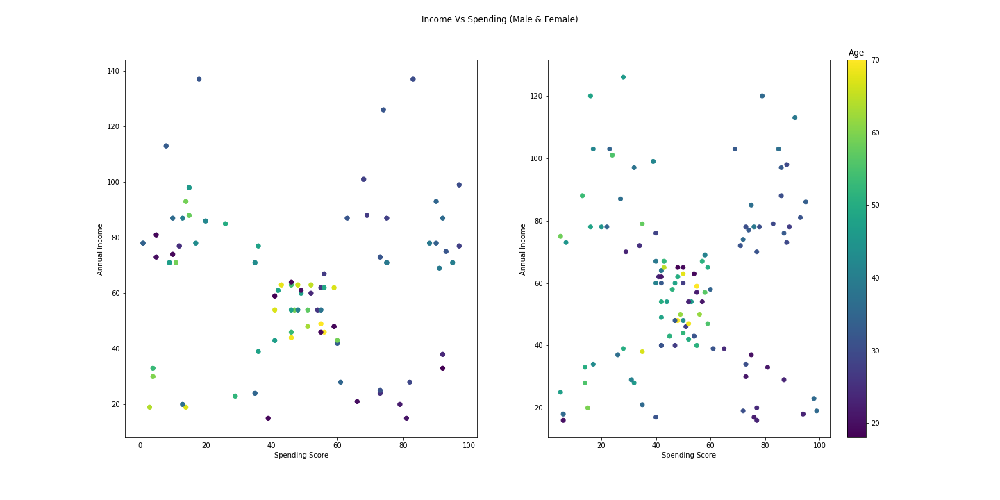
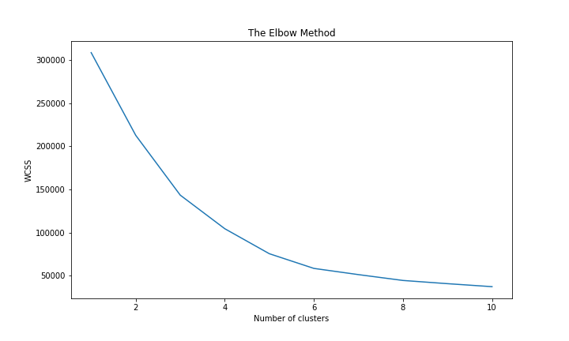
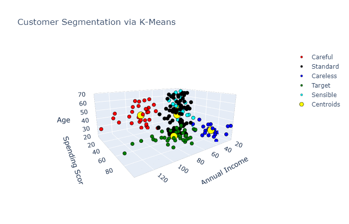
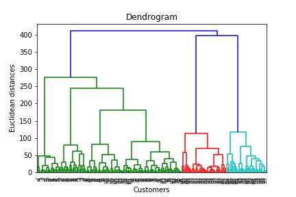
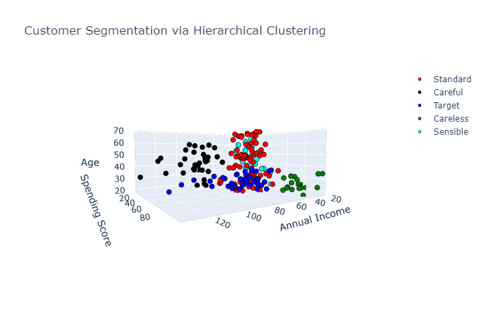

# Exploring Different Clustering Techniques

Part of SMM636 Machine Learning Coursework 4 submission which explores different clustering techniques using the Mall Customers dataset.

### What is clustering in machine learning? 

Clustering is a type of unsupervised learning algorithm that groups data points into a specific group. The algorithm does not look at target/labels. Instead, it groups the data by taking into account the similarities in the features.

## K-Means

The K-Means clustering algorithm is an iterative process where the algorithm minimises the distance of the data point from the average data point in the cluster.

## Hierarchical Clustering

Hierarchical clustering algorithms creates hierarchy of clustered data points. It minimises the number of clusters by merging those closest to one another using a distance measurement such as Euclidean distance for numeric clusters or Hamming distance for text.

## Applying K-Means and Hierarchical Clustering on Mall Customers Dataset

### Exploratory Phase

The majority of customers from both genders come from customer at the ages between 25-35. Another frequent female group is at the age between 45-50 years old. In constrast, the group of men frequency curve declines as the age increases.

We explore the age distribution of the Customers by age. We do not see much difference between men and women aside from men having a larger variance with age distribution. With regards to annual income, we note the outlier point and in comparison to the spending score, the annual income is higher. However this interpretation of this is subjective to how the spending score was determined. For comparison purposes, we did match the scale to note that the spending score is limited to a range of 0 to 100. Meaning that comparing the two may not prove useful.

Males: 

Here we can see that younger men tend to spend more than older men. The few men spending beyond their means (lower right) are generally younger. Within the center of the plot we see a cluster of points made primarily from older gentlemen. We will conduct some analysis on this, although we suspect that this group of people could be middle class men spending within their means.

Females: 

Similar to men, we see that younger females have a higher spending score. Again, we see the central cluster. Interestingly, we see quite a few more lower income female customers spending significatly more, possibly beyond their means. Whilst contrastingly, we see that the high income older females have a more stringent spending habit (upper left corner).

### K-Means

We now apply K-Means Clustering to identify clusters within the dataset. Through this, we can start to gather customer segments that the user of the data can utilise. For example, through customer cluster identification, the user (let us say Harrods), can begin more efficient targetted advertising or running promotions to effectively target specific clusters. Note, we also use the elbow method to find the optimal number of clusters. This may not be a viable option in cases where the elbow bend is not clear.

The optimal number of clusters for this dataset is 5 clusters, since the elbow is visible at 5.

From the K-means clustering observation, it can be interpreted that:

Cluster one: clients earn high income and spend a lot of money at the mall. This segment can be called main potential clients.

Cluster two: clients earn high income as well but did not spend much at the mall. This segment can be called potential clients.

Cluster three: clients earn low income but spend alot. This segment can be called risk averse/careless clients.

Cluster four: clients earn average income and average spending at the mall. This segment can be called standard clients.

Cluster five: clients earn low income and have low spending. This segment can be called sensible clients.

Having a better understanding of the customers segments, a company could make better and more informed decisions. An example, there are customers with high annual income but low spending score. Again, a more strategic and targeted marketing approach could lift their interest and improve advertising/marketing efficiency.

### Hierarchical Clustering

We use the dendrogram to find the optimal number of clusters via euclidean distant between the two, meaning for each pair of customers we take the two coordinates annual income and spending score and we compute the euclidean distance between the two based on this coordinate.

The result appears to be highly similar to that of K-means clustering, in which all of the clusters could be interpreted in the same way as the previous method.

